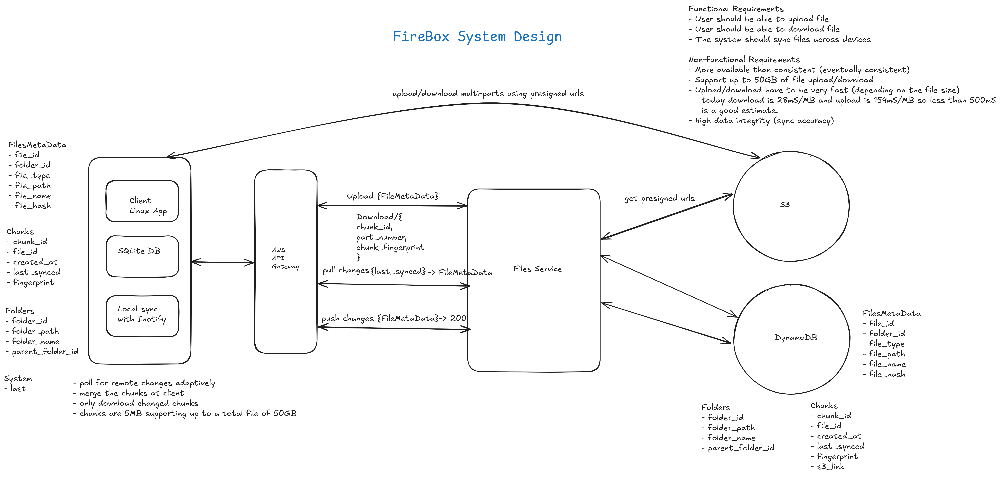

# dropbox-system-design

This repository contains the source code and design documents for a Dropbox-like file synchronization system. The system is designed to efficiently synchronize files across multiple devices with support for large files.

Many thanks to [Hello Interview](https://www.hellointerview.com/learn/system-design/problem-breakdowns/dropbox) for the original design.
